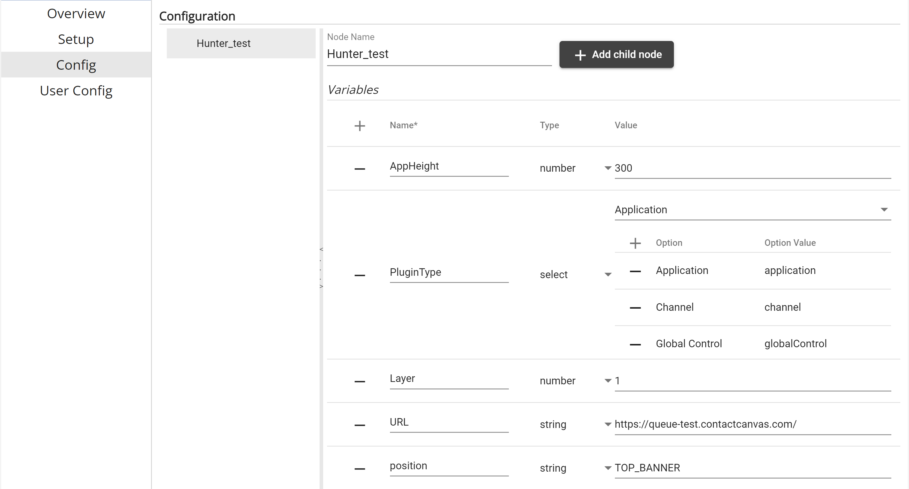

# Queue Demo Application

## About

This project demonstrates the use of the new position "TOP_BANNER" above the dialpad and the capabilities of using this area. In addition, the project will also display the usage of all 4 new API calls: queueUpdate, queueAction, registerQueueUpdate, and registerQueueAction.

## Configurations

There are 5 configurations that must be in place when creating a new app for this demonstration project. The first of the configurations is `AppHeight` of type Number. Make sure all configurations are spelled and capitalized exactly as shown in the read me. The AppHeight can be any desired value the user would like to set. AppHeight will be used to set the application height when expanding outside of the base 20 pixels given by the top banner. In this application, the reccommended app height is 350. The next required configuration will be the `PluginType` of type Select. There are three options required: Application - Option Value: application, Channel - Option Value: channel, and Global Control - Option Value: globalControl. For the Value selection, choose type Application. The next configuration requried will be `Layer`. The type will be of number and the value should be 1. Layer allows for the application to gray out the background when expanding the application. One important config change that must be used with Layer is also applying the same Layer config and value to Global Presence. This makes sure there is no layer issues when determining which application displays above the other. Next in order to use this new position created above the dialpad, create a position configuration of type string and make the value 'TOP_BANNER'. Finally create a URL configuration of type string and use the URL hosting the application.

## Development server

In the Program.cs file, your license will need to be added with the proper password.
Run `dotnet run` within the main project. Navigate to `https://127.0.0.1:5001/`. When running the application, the application can be hosted by softwares such as Fiddler.
Take the URL at which this application is being hosted, naviagate to Creator Studio. If an app was already created, navigate to edit the app, go to configs, if not a URL config, create one.
Name it `URL` and insert the hosted url link as the value. 

## Additional Apps

There were two additional apps reccommended when using this application in order to see a full effect of the capabilities.
1. Call Simulator
2. Global Presence
  &nbsp;- In configs you must add <b>"Layer"</b> with type number and set the value as the same value used in section configurations for this application.
